# 🏗️ FortressAI System Architecture - Mermaid Diagram

## Complete Ingress & Egress Flow with Security Layers


## 🔐 Security Layer Details

### INGRESS BROKER - Front Door Protection

#### Layer 1: Authentication & Authorization
- **API Key Validation**: SHA256 hashed keys
- **RBAC**: Role-based access control per agent
- **Rate Limiting**: Per-client throttling

#### Layer 2: Multi-Layer Firewall
**⚡ Fast Regex Layer (1-2ms)**
- 20+ jailbreak patterns
- HTML injection detection
- Payload size limits (10KB max)

**🧠 LLM Semantic Layer (50-100ms)**
- PromptShield model (RoBERTa-based)
- 99.33% accuracy on prompt injection
- Catches sophisticated attacks:
  - Synonym-based jailbreaks
  - Obfuscated instructions
  - Role manipulation
  - Indirect prompt leaks

#### Layer 3: Banking Security
- PAN (Primary Account Number) detection
- CVV detection
- Card number blocking
- Zero tolerance policy

#### Layer 4: Secret Redaction
- AWS keys: `AKIA[0-9A-Z]{16}`
- API keys: `api_key=xxx`
- PEM certificates
- JWT tokens

#### Layer 5: JWT Capability Tokens
- Algorithm: HS256
- Claims: tools, scopes, budgets
- Expiry: 5 minutes
- Principle: Least privilege

---

### EGRESS GATEWAY - Back Door Protection

#### Layer 1: Quarantine Management
- Compromised agent lockout
- Immediate isolation
- All requests blocked

#### Layer 2: Deterministic Threat Rules (0-100 points)
| Rule | Score | Description |
|------|-------|-------------|
| Denylist Domain | +70 | pastebin.com, filebin.net, etc. |
| Secrets in Body | +100 | AWS keys, API keys, PEM, SSN |
| Base64 Blob | +15 | Potential data exfiltration |
| Oversized Payload | +20 | >3x baseline size |
| Suspicious Method | +10 | GET with large body |

#### Layer 3: Behavior DNA Analysis (0-50 points)
**Per-Agent Baseline Tracking:**
- Average payload size
- Request frequency (per minute)
- Known domains & APIs
- Active hours pattern

**Anomaly Detection (after 10 samples):**
| Anomaly | Score | Description |
|---------|-------|-------------|
| New Domain | +30 | First-time domain access |
| New API | +30 | New API endpoint |
| Frequency Spike | +25 | >5x average rate |
| Odd Hour | +10 | ±3h from baseline |
| Oversized Payload | +20 | >3x max baseline |

#### Layer 4: Banking Network Policy
- Allowlist enforcement (core-banking.internal, payments.internal)
- Email API blocking (sendgrid.com, mailgun.com)
- PII scanning in responses
- Response content hashing

#### Layer 5: LLM Auditor (Optional, 0-20 points)
- Model: Claude 3.5 Sonnet
- Risk levels: low (0), medium (+8), high (+15)
- Obfuscation detection: +5
- Timeout: 1 second (fail gracefully)
- Secrets masked before analysis

#### Layer 6: Final Scoring & Action
```
Final Score = Rules + Behavior + LLM (capped at 100)

Action Thresholds:
< 40:  ✅ ALLOW (execute request)
40-59: ✅ ALLOW+WATCH (log for monitoring)
60-79: 🚨 BLOCK (deny request)
≥ 80:  ⚠️ QUARANTINE (lock agent)
Secret: ⚠️ QUARANTINE (immediate)
```

---

## 🎯 Attack Scenarios

### Scenario 1: Prompt Injection Attack

```mermaid
sequenceDiagram
    participant Attacker
    participant Broker
    participant Agent
    
    Attacker->>Broker: POST /invoke<br/>"ignore previous instructions"
    
    Note over Broker: Layer 1: Regex Check
    Broker->>Broker: 🚨 DETECTED: jailbreak pattern
    
    Broker-->>Attacker: ❌ BLOCK<br/>reason: instruction_override
    
    Note over Agent: ✅ Agent never receives<br/>malicious prompt
```



### Scenario 2: Data Exfiltration Attempt

```mermaid
sequenceDiagram
    participant Agent
    participant Gateway
    participant Pastebin
    
    Agent->>Gateway: POST /proxy<br/>url: pastebin.com<br/>body: "api_key=sk-live-xxx"
    
    Note over Gateway: Layer 2: Deterministic Rules
    Gateway->>Gateway: 🚨 Denylist domain: +70
    Gateway->>Gateway: 🚨 Secret detected: +100
    Gateway->>Gateway: Final Score: 100
    
    Note over Gateway: ⚠️ QUARANTINE ACTION
    Gateway->>Gateway: Add to quarantined_agents
    
    Gateway-->>Agent: ❌ QUARANTINE<br/>score: 100
    
    Note over Pastebin: ✅ Request never reaches<br/>external service
```



### Scenario 3: Legitimate Request Flow

```mermaid
sequenceDiagram
    participant User
    participant Broker
    participant Agent
    participant Gateway
    participant GitHub
    
    User->>Broker: POST /invoke<br/>"Get GitHub repo info"
    
    Note over Broker: ✅ All checks pass
    Broker->>Broker: Generate JWT token
    
    Broker->>Agent: Forward with JWT
    
    Agent->>Agent: ✅ JWT valid
    Agent->>Gateway: POST /proxy<br/>url: api.github.com
    
    Note over Gateway: ✅ Score: 0 (ALLOW)
    Gateway->>GitHub: GET /repos/microsoft/vscode
    
    GitHub-->>Gateway: 200 OK + data
    Gateway-->>Agent: Response
    Agent-->>Broker: Processed result
    Broker-->>User: ✅ Success
```



---

## 📊 Performance Metrics

| Component | Response Time | Throughput | Detection Rate |
|-----------|--------------|------------|----------------|
| **Broker (Regex only)** | < 2ms | 1000+ req/s | 70% |
| **Broker (with LLM)** | < 100ms | 200+ req/s | 90%+ |
| **Gateway (Deterministic)** | < 100ms | 500+ req/s | 85% |
| **Gateway (with LLM)** | < 500ms | 100+ req/s | 95%+ |
| **End-to-End** | < 200ms | 200+ req/s | 95%+ |

---

## 🔒 Network Isolation

```mermaid
graph LR
    subgraph Public["PUBLIC NETWORK<br/>(Internet Access)"]
        Internet["🌐 Internet"]
        Broker["🛡️ Broker<br/>:8001"]
        Gateway["🚪 Gateway<br/>:9000"]
    end
    
    subgraph Mesh["MESH NETWORK<br/>(Internal Only)"]
        Agent["🤖 Agent<br/>:7000"]
    end
    
    Internet <-->|"Exposed"| Broker
    Internet <-->|"Exposed"| Gateway
    
    Broker <-->|"Internal"| Agent
    Agent <-->|"Internal"| Gateway
    
    Agent -.->|"❌ BLOCKED"| Internet
    
    style Agent fill:#8b5cf6,stroke:#6d28d9,stroke-width:3px
    style Broker fill:#3b82f6,stroke:#1e40af,stroke-width:3px
    style Gateway fill:#10b981,stroke:#059669,stroke-width:3px
    style Internet fill:#ef4444,stroke:#dc2626,stroke-width:2px
```



**Key Security Principle**: Agent is completely isolated from the internet. All outbound requests must go through the Gateway, which applies multi-layer security checks.

---

## 📋 Compliance & Audit Trail

```mermaid
graph TD
    subgraph Logs["📊 AUDIT LOGS (JSONL)"]
        BrokerLog["broker_log.jsonl<br/>━━━━━━━━━━━━━━<br/>• All ingress requests<br/>• Auth failures<br/>• Firewall blocks<br/>• Redaction events<br/>• LLM confidence scores"]
        
        GatewayLog["gateway_log.jsonl<br/>━━━━━━━━━━━━━━<br/>• All egress requests<br/>• Risk scores<br/>• Actions taken<br/>• Upstream responses"]
        
        IncidentLog["incidents.jsonl<br/>━━━━━━━━━━━━━━<br/>• BLOCK events<br/>• QUARANTINE events<br/>• Security violations"]
        
        A10Log["a10_control_log.jsonl<br/>━━━━━━━━━━━━━━<br/>• WAF actions<br/>• Quarantine triggers<br/>• Policy enforcement"]
    end
    
    subgraph Compliance["📋 COMPLIANCE REPORTS"]
        Health["Health Score<br/>━━━━━━━━━━━━━━<br/>0-100 based on<br/>recent incidents"]
        
        Evidence["Evidence Pack<br/>━━━━━━━━━━━━━━<br/>HTML report with:<br/>• NIS2 attestation<br/>• DORA compliance<br/>• SOC2 controls<br/>• PCI DSS evidence"]
    end
    
    BrokerLog --> Evidence
    GatewayLog --> Evidence
    IncidentLog --> Health
    A10Log --> Evidence
    
    style BrokerLog fill:#f59e0b,stroke:#d97706
    style GatewayLog fill:#f59e0b,stroke:#d97706
    style IncidentLog fill:#ef4444,stroke:#dc2626
    style A10Log fill:#ef4444,stroke:#dc2626
    style Health fill:#10b981,stroke:#059669
    style Evidence fill:#3b82f6,stroke:#1e40af
```



---

## 🚀 Technology Stack

| Layer | Technology |
|-------|-----------|
| **Language** | Python 3.11 |
| **Web Framework** | FastAPI |
| **HTTP Client** | httpx (async) |
| **JWT** | PyJWT |
| **Ingress LLM** | PromptShield (RoBERTa-base) |
| **Egress LLM** | Claude 3.5 Sonnet |
| **ML Framework** | PyTorch + Transformers |
| **Containerization** | Docker + Docker Compose |
| **Logging** | JSONL (JSON Lines) |
| **Storage** | In-memory + File-based |

---

## 🎯 Key Innovations

1. **Multi-Layer Defense**: Regex (fast) + LLM (accurate) = 90%+ detection
2. **Behavior DNA**: Learns each agent's unique patterns, not just static rules
3. **Zero-Trust Architecture**: Agent completely isolated, all traffic monitored
4. **Capability Tokens**: JWT-based fine-grained permissions (least privilege)
5. **Banking-Grade Security**: PAN/CVV detection, allowlist enforcement, PII scanning
6. **Auto-Quarantine**: Compromised agents locked out instantly
7. **Real-Time Compliance**: Evidence generated automatically
8. **Semantic Analysis**: Catches sophisticated attacks that bypass regex
9. **Behavioral Anomaly Detection**: Detects zero-day attacks based on behavior changes
10. **Comprehensive Audit Trail**: Every request logged with full context

---

**Status**: Production-Ready ✅  
**Last Updated**: 2025-10-03  
**Version**: 1.0.0
